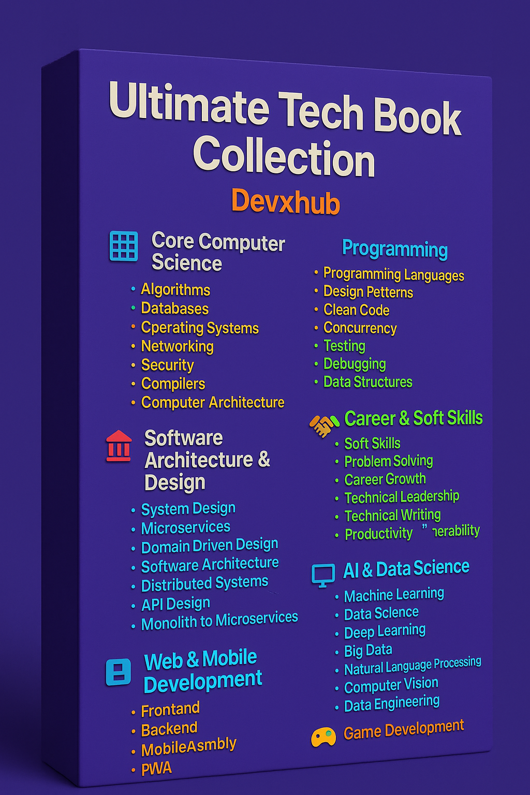

<!--
  Modern & Advanced Professional README for Books-Collection
-->

  
  <h1>📚 Ultimate Tech Book Collection</h1>
  

    <strong style="font-size:1.2em;">A meticulously curated collection of technical books covering programming, software engineering, system design, and more.</strong>
  

  

    <a href="#categories">Categories</a> •
    <a href="#featured-books">Featured Books</a> •
    <a href="#how-to-use">How to Use</a> •
    <a href="#contributing">Contributing</a>
  

   
  
  
  
    
  
  

---

## 📚 Complete Book List

👉 [View the full list of books and authors here!](BOOKS_LIST.md)

---

## 📄 License

This project is licensed under the **MIT License** - see the [LICENSE](LICENSE) file for details.

---

## ⚠️ Disclaimer
This repository contains a collection of books for educational purposes only. We do not own the rights to these books. Please support the authors by purchasing the books if you find them valuable.

---

## 🗂 Categories

### 🧮 Core Computer Science
- **📚 Algorithms** - Classic algorithm books and competitive programming resources
- **💾 Databases** - SQL, NoSQL, database design, and optimization
- **💻 Operating Systems** - OS concepts, design, and implementation
- **🌐 Networking** - Computer networks, protocols, and distributed systems
- **🔐 Security** - Cybersecurity, encryption, and secure coding practices
- **⚙️ Compilers** - Language processing and compiler design
- **🧮 Computer Architecture** - Hardware and system organization

### 💻 Programming
- **⌨️ Programming Languages** - Language-specific books and guides
- **🎨 Design Patterns** - Software design patterns and best practices
- **✨ Clean Code** - Writing maintainable and efficient code
- **🔄 Concurrency** - Parallel and concurrent programming
- **🧪 Testing** - Software testing methodologies and tools
- **🔍 Debugging** - Debugging techniques and tools
- **📊 Data Structures** - Essential data structures and their implementations

### 🏗 Software Architecture & Design
- **🏢 System Design** - Large-scale system design principles
- **🧩 Microservices** - Building and managing microservices
- **🧭 Domain-Driven Design** - DDD principles and patterns
- **🏛️ Software Architecture** - Architectural patterns and best practices
- **📡 Distributed Systems** - Design and implementation of distributed systems
- **🧱 API Design** - REST, GraphQL, and API best practices
- **📦 Monolith to Microservices** - Migration strategies and patterns

### 🛠 DevOps & Cloud
- **🚀 DevOps** - CI/CD, automation, and infrastructure
- **🐳 Docker & Kubernetes** - Containerization and orchestration
- **☁️ Cloud Computing** - AWS, Azure, GCP, and cloud patterns
- **🔧 Infrastructure as Code** - Terraform, Ansible, and configuration management
- **⚡ Performance Engineering** - System optimization and scaling
- **📊 Monitoring & Observability** - Logging, metrics, and tracing
- **🛡️ DevSecOps** - Security in DevOps practices

### 📈 Career & Soft Skills
- **🤝 Soft Skills** - Communication, leadership, and teamwork
- **🧩 Problem Solving** - Technical interview preparation
- **📈 Career Growth** - Professional development resources
- **💼 Technical Leadership** - Leading engineering teams
- **📝 Technical Writing** - Documenting software effectively
- **💡 Productivity** - Time management and productivity hacks
- **🌱 Career Transitions** - Moving between tech roles

### 🤖 AI & Data Science
- **🧠 Machine Learning** - ML algorithms and applications
- **📊 Data Science** - Data analysis and visualization
- **🔍 Deep Learning** - Neural networks and advanced ML
- **📈 Big Data** - Large-scale data processing
- **🤖 Natural Language Processing** - Text processing and understanding
- **🖼️ Computer Vision** - Image and video analysis
- **📊 Data Engineering** - Building data pipelines

### 🌐 Web & Mobile Development
- **🖥️ Frontend** - HTML, CSS, JavaScript, and frameworks
- **🔙 Backend** - Server-side development
- **📱 Mobile** - iOS and Android development
- **🌍 Web Assembly** - High-performance web applications
- **🔒 Web Security** - Web application security practices
- **⚡ PWA** - Progressive Web Apps
- **📱 React Native/Flutter** - Cross-platform mobile development

### 🎮 Game Development
- **🎮 Game Design** - Game development principles
- **⚙️ Game Engines** - Unity, Unreal, and more
- **🎨 Game Graphics** - Computer graphics and shaders
- **🎵 Game Audio** - Sound design and implementation
- **🕹️ Game AI** - Artificial intelligence in games
- **📱 Mobile Games** - Mobile game development
- **🌐 Web Games** - Browser-based game development

### 🔐 Security
- **🔒 Application Security** - Secure coding practices
- **🛡️ Network Security** - Protecting network infrastructure
- **🔑 Cryptography** - Encryption and security protocols
- **👨‍💻 Ethical Hacking** - Security testing and penetration testing
- **🔍 Digital Forensics** - Investigating security incidents
- **🌐 Web Security** - Securing web applications
- **📱 Mobile Security** - Mobile app security best practices

### 🧠 Artificial Intelligence
- **🤖 AI Fundamentals** - Core AI concepts and theory
- **🧠 Neural Networks** - Deep learning architectures
- **🗣️ NLP** - Natural Language Processing
- **👁️ Computer Vision** - Image and video analysis
- **🤖 Reinforcement Learning** - AI decision making
- **🧬 Generative AI** - GANs, Transformers, and creative AI
- **⚖️ AI Ethics** - Responsible AI development

### 🌍 Web3 & Blockchain
- **⛓️ Blockchain Basics** - Fundamentals of blockchain technology
- **🪙 Cryptocurrencies** - Bitcoin, Ethereum, and altcoins
- **📜 Smart Contracts** - Ethereum, Solidity, and DApps
- **🌐 Web3 Development** - Building decentralized applications
- **🔒 DeFi** - Decentralized Finance
- **🖼️ NFTs** - Non-fungible tokens and digital ownership
- **🔐 Blockchain Security** - Securing blockchain applications
- **🌉 Layer 2 Solutions** - Scaling blockchain networks

### 🧰 Software Development Tools
- **🔧 Version Control** - Git, GitHub, and collaboration
- **📦 Package Managers** - npm, pip, Maven, etc.
- **🚀 CI/CD** - Continuous Integration and Deployment
- **🐳 Containers** - Docker and containerization
- **☸️ Kubernetes** - Container orchestration
- **📝 IDEs & Editors** - Development environments
- **🔍 Debugging Tools** - Debugging and profiling software
- **📊 Performance Tools** - Performance analysis and optimization

---
## 🔍 Featured Books

### 🏆 Top Picks
- **Clean Code** by Robert C. Martin - `Programming/Clean Code`
- **Designing Data-Intensive Applications** by Martin Kleppmann - `Databases/Design`
- **Head First Design Patterns** by Eric Freeman & Elisabeth Robson - `Programming/Design Patterns`
- **Building Microservices, 2nd Edition** - `Software Architecture/Microservices`
- **The Pragmatic Programmer** by Andrew Hunt & David Thomas - `Programming`

### 🔥 Recently Added
- **Designing Web APIs** by Brenda Jin, Saurabh Sahni, Amir Shevat - `Programming`
- **System Design Interview** by Alex Xu - `Software Architecture/System Design`
- **Clean Architecture** by Robert C. Martin - `Software Architecture`

---

## 🚀 How to Use

1. **Browse by Category**: Navigate through the folder structure to find books by topic
2. **Search**: Use GitHub's search functionality to find specific books or topics
3. **Download**: Click on any book to view or download it
4. **Contribute**: Add your own books by creating a pull request

---

## 🤝 Contributing

Contributions are welcome! Here's how you can contribute:

1. Fork the repository
2. Add your book to the appropriate category
3. Update the README if needed
4. Submit a pull request

Please ensure any books you add are legally shareable and properly attributed.

---

